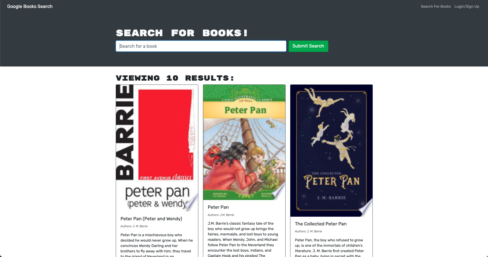

# Book Search Engine

## Screenshot

## Description

Refactor a fully functioning Google Books API search engine built with a RESTful API, and refactor it to be a GraphQL API built with Apollo Server. The app was built using the MERN stack, with a React front end, MongoDB database, and Node.js/Express.js server and API. It was already set up to allow users to save book searches to the back end.

## Table of Contents

- [Links](#links)
- [Installation](#installation)
- [Tech Used](#tech-used)
- [Questions](#questions)
- [License](#license)

## Links

- **[GitHub Repo](https://github.com/mjos7/book-search-engine)**
- **[Deployed Live App]()**

## Installation

- Run NPM install in the client and server folder
- Navigate to the root directory and run:
  - `npm install`
- To start the server, in the command line run:
  - `npm start`

## Tech Used

- React
- React Router
- React-bootstrap
- GraphQL
- Apollo Client
- Apollo Server
- Json Web Token (JWT-Decode package)
- Node
- Express
- MongoDB
- Mongoose
- Heroku

## Questions

Please don't hesitate to reach out if you have any suggestions or feedback

## License

This app is licensed under the MIT license.
